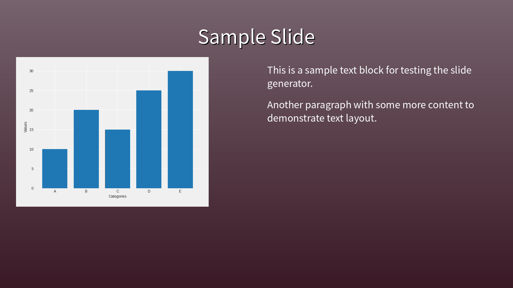
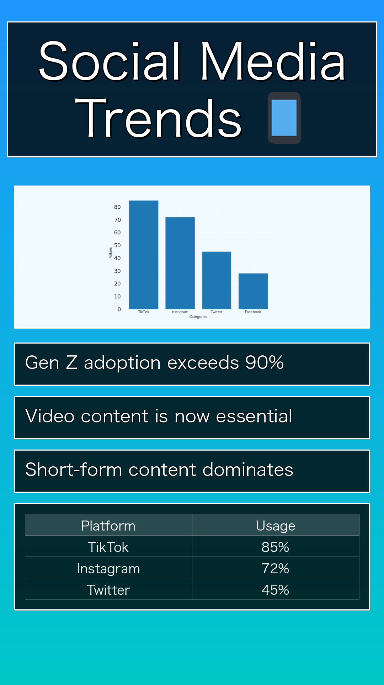

# data2slideimg

Convert JSON data to slide images.

## Formats

### Horizontal (1920x1080)


### Vertical (1080x1920) - Stories format


## Usage

CLI:
```bash
uv run python -m src.cli -i input.json -o output.png
```

API:
```bash
uv run python -m src.main
```

## API Endpoints

- `POST /generate` - Generate slide image
- `GET /.well-known/schemas/slide-generator.json` - JSON Schema

### API Usage with curl

Generate slide image:
```bash
curl -X POST http://localhost:8000/generate \
  -H "Content-Type: application/json" \
  -d @test_input.json \
  --output slide.png
```

Get JSON schema:
```bash
curl http://localhost:8000/.well-known/schemas/slide-generator.json
```

## License

WTFPL