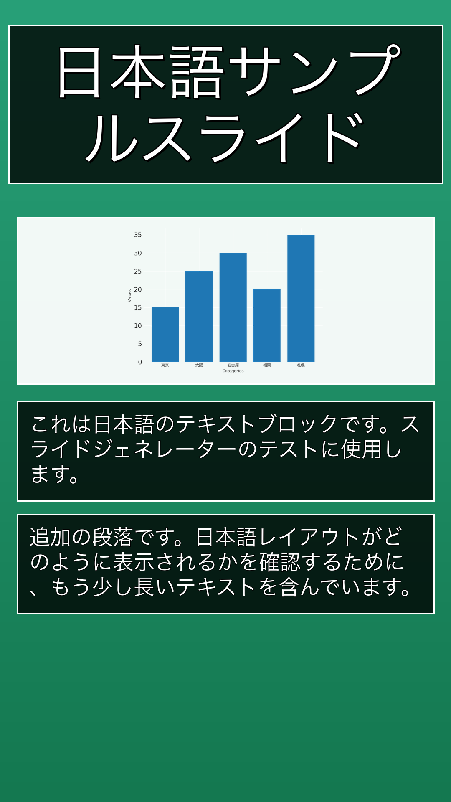
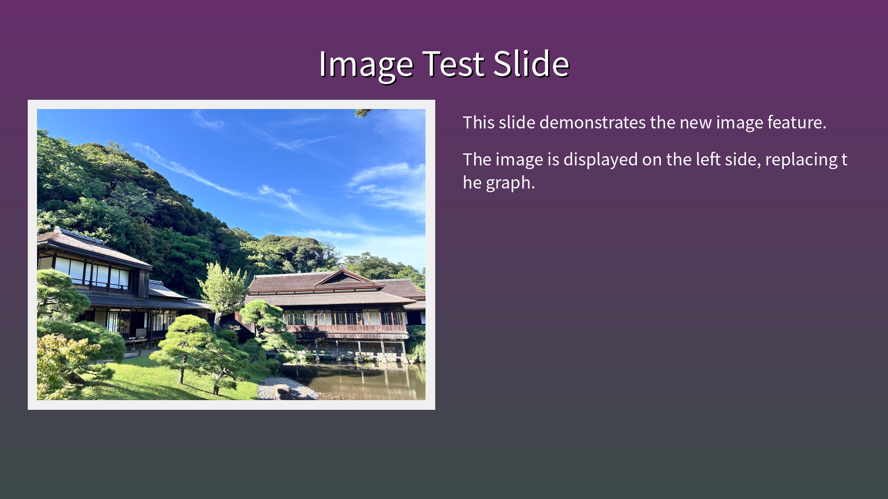
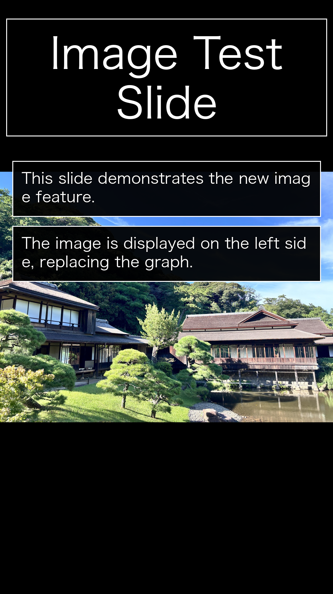
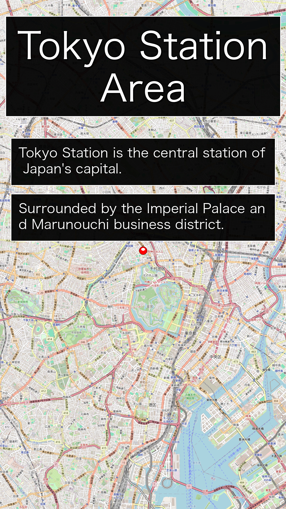

# Sample Slides

This directory contains sample JSON files and their generated slide images demonstrating different chart types and table functionality.

## Chart Types

### Bar Chart
- **Input**: [bar_chart.json](bar_chart.json)
- **Horizontal**: 
- **Vertical**: 

### Line Chart
- **Input**: [line_chart.json](line_chart.json)
- **Horizontal**: 
- **Vertical**: 

### Pie Chart
- **Input**: [pie_chart.json](pie_chart.json)
- **Horizontal**: 
- **Vertical**: 

## Table Sample
- **Input**: [table_sample.json](table_sample.json)
- **Horizontal**: 
- **Vertical**: 

## Japanese Sample
- **Input**: [japanese_sample.json](japanese_sample.json)
- **Horizontal**: 
- **Vertical**: 

## Image Sample
- **Input**: [image_sample.json](image_sample.json)
- **Horizontal**: 
- **Vertical**: 

## Map Sample
- **Input**: [map_sample.json](map_sample.json) / [map_sample_vertical.json](map_sample_vertical.json)
- **Horizontal**: 
- **Vertical**: 
- **Features**: OpenStreetMap tiles with red marker at center point

## Vertical Format (Stories)
- **Input**: [vertical_sns_analysis.json](vertical_sns_analysis.json)
- **Output**: 
- **Format**: 1080x1920 (9:16 aspect ratio)
- **Features**: Glassmorphism cards, vibrant gradients, mobile-optimized text sizes

## Usage

To generate these samples yourself:

```bash
uv run python -m src.cli -i docs/samples/bar_chart.json -o output.png
```